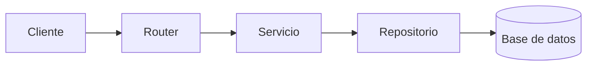

Estudiante de Tecnología en Análisis y Desarrollo de Software (SENA), enfocado en desarrollo backend y arquitectura de aplicaciones.

**Contacto:** [LinkedIn](https://www.linkedin.com/in/juan-pablo-castillo-velasquez-86542a214/) · [Correo](mailto:juanpablo2007k@gmail.com) · [GitHub](https://github.com/Juan-Pablo-Castillo-Velasquez)

---

## Sobre mí

Trabajo principalmente con Java, Python, PHP y C#, aplicando estos conocimientos en proyectos reales mientras avanzo en mi formación. Me interesa entender cómo estructurar aplicaciones de forma clara, mantenible y fácil de escalar.

Actualmente desarrollo **AleckTours**, una plataforma de agencia de viajes con frontend en React y TypeScript, backend en FastAPI, y un entorno de desarrollo con Docker.

Disponible para prácticas o pasantías en desarrollo backend o full-stack.

---

## Proyecto destacado — AleckTours

Plataforma de agencia de viajes con frontend y backend separados.

- Frontend: React, TypeScript, Vite, Tailwind CSS
- Backend: FastAPI, con separación en capas (router, servicio, repositorio)
- Autenticación de usuarios: registro, inicio de sesión y recuperación de contraseña
- Entorno reproducible con Docker Compose

Repositorio: [proyectoalectoursDocker](https://github.com/Juan-Pablo-Castillo-Velasquez/proyectoalectoursDocker)

---

## Arquitectura

Estructura en capas aplicada en el backend de FastAPI, separando la entrada de peticiones, la lógica de negocio y el acceso a datos.

| Capa | Responsabilidad |
|---|---|
| Router | Recibe la petición y valida la entrada |
| Servicio | Contiene la lógica de negocio |
| Repositorio | Gestiona el acceso a la base de datos |

Entorno de desarrollo orquestado con Docker Compose para que sea reproducible en cualquier máquina.

---

## Habilidades técnicas

| Área | Tecnologías |
|---|---|
| Lenguajes | Java, Python, PHP, C#, JavaScript, TypeScript, SQL |
| Backend | Spring Boot, FastAPI, Django |
| Frontend | React, Tailwind CSS |
| Bases de datos | PostgreSQL, MySQL |
| Herramientas | Docker, Git, GitHub Actions, SonarQube |

---

## Certificaciones

| Certificación | Institución | Duración | Año | |
|---|---|:---:|:---:|:---:|
| Fundamentos de Programación con Python | Universidad Sergio Arboleda | 160h | 2023 | [Ver](https://drive.google.com/file/d/1Tdrgsab5EeE4p2CqL7P2nfFiH_TfJD_R/view) |
| Fundamentos de Programación con Java | Universidad Sergio Arboleda | 160h | 2023 | [Ver](https://drive.google.com/file/d/1U9NKq3cKCl3_HjUlFwKM0bWgpX_c1DvW/view) |
| KITE English Test (Inglés B1) | Kaplan International | — | — | [Ver](https://drive.google.com/file/d/12YHI065jVXo_cjAISbhjtjT_mmzD7bkE/view) |

---

Abierto a oportunidades de práctica o pasantía en desarrollo de software. Puedes escribirme por [LinkedIn](https://www.linkedin.com/in/juan-pablo-castillo-velasquez-86542a214/) o [correo](mailto:juanpablo2007k@gmail.com).

